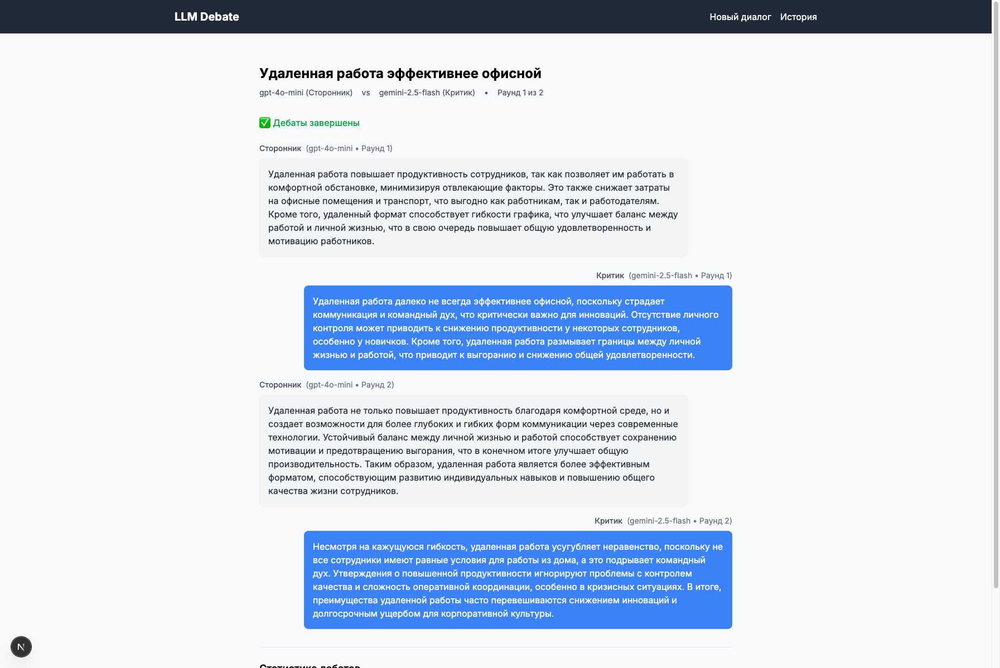

# LLM Debate MVP

Минимальная версия веб-приложения для проведения интеллектуальных дебатов между языковыми моделями.

## Возможности

- Дебаты между GPT-4o-mini и Gemini 2.5 Flash
- Две роли: Сторонник и Критик
- Настраиваемое количество раундов (1-10)
- Регулировка креативности ответов (температура 0.2-1.0)
- Сохранение истории дебатов в локальной SQLite базе
- История всех проведенных дебатов
- Примеры тем для быстрого старта
- Настройка максимальной длины ответов

## Демо



## Требования

- Node.js 18+
- npm или yarn
- API ключи от OpenAI и Google

## Установка

1. Клонируйте репозиторий:
```bash
git clone https://github.com/ash16888/llm-debate.git
cd llm-debate
```

2. Установите зависимости:
```bash
npm install
```

3. Создайте файл `.env.local` на основе примера:
```bash
cp .env.local.example .env.local
```

4. Отредактируйте `.env.local` и добавьте ваши API ключи:
```
OPENAI_API_KEY=sk-...
GOOGLE_API_KEY=AIza...
```

## Запуск

### Режим разработки
```bash
npm run dev
```
Приложение будет доступно по адресу http://localhost:3000

### Продакшен сборка
```bash
npm run build
npm start
```

## Скрипты

- `npm run dev` - запуск в режиме разработки
- `npm run build` - сборка для продакшена
- `npm start` - запуск продакшен версии
- `npm run lint` - проверка кода линтером
- `npm run type-check` - проверка типов TypeScript

## Структура проекта

```
llm-debate/
├── app/                           # Next.js App Router
│   ├── api/                      # API endpoints
│   │   ├── debates/              # Создание и управление дебатами
│   │   └── messages/             # Генерация сообщений
│   ├── debate/[id]/              # Страница дебатов
│   ├── history/                  # История дебатов
│   └── page.tsx                  # Главная страница
├── components/                   # React компоненты
│   ├── DebateSetup.tsx          # Форма настройки дебатов
│   ├── DebateArena.tsx          # Интерфейс дебатов
│   └── MessageBubble.tsx        # Компонент сообщения
├── lib/                          # Утилиты и интеграции
│   ├── db.ts                    # SQLite база данных
│   ├── llm-providers.ts         # Интеграция с LLM
│   └── prompts.ts               # Промпты для дебатов
├── types/                        # TypeScript типы
│   └── debate.ts                # Типы для дебатов
├── debates.db                   # Локальная БД (создается автоматически)
├── .env.local                   # API ключи (создайте из .env.local.example)
└── .env.local.example           # Пример файла с ключами
```

## Технологии

- **Frontend**: Next.js 15, React 19, TypeScript, Tailwind CSS
- **Backend**: Next.js API Routes
- **База данных**: SQLite с better-sqlite3
- **LLM провайдеры**: OpenAI API, Google Generative AI

## Особенности реализации

- **Параллельная генерация**: Ответы обеих моделей генерируются одновременно для ускорения дебатов
- **Контекст дебатов**: Каждый раунд учитывает всю предыдущую историю обсуждения
- **Гибкие промпты**: Система промптов адаптируется к роли участника и стадии дебатов
- **Автоматическое завершение**: Дебаты автоматически помечаются как завершенные после последнего раунда

## Лицензия

ISC